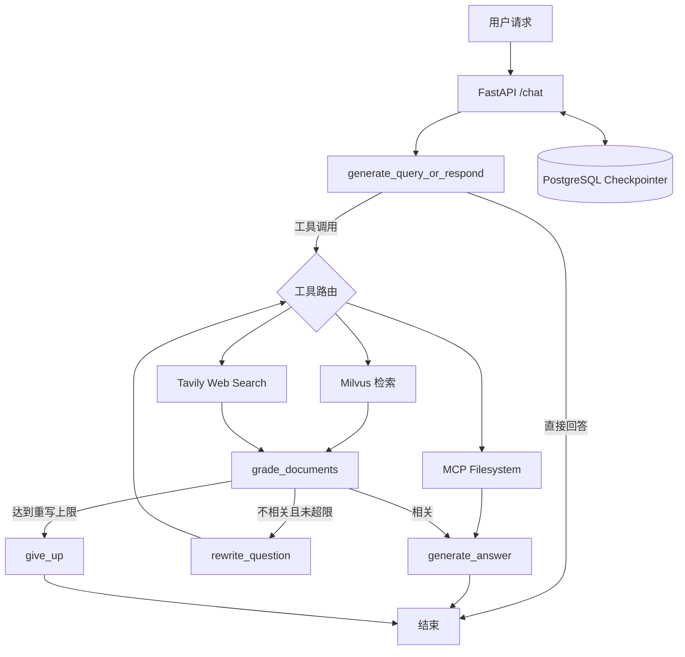

# Agentic RAG

一个面向 FastAPI 中文文档问答的 Agentic RAG 服务。项目使用 LangGraph 编排工具选择、检索、相关性判断、查询改写和答案生成，并通过 FastAPI 以 SSE 流式返回结果。

## 核心能力

- **动态工具路由**：模型可直接回答，或选择 Milvus、Tavily Web Search 和 MCP Filesystem。
- **混合检索**：Milvus 同时支持 Dense、BM25，以及 Dense + BM25 + RRF。
- **纠错检索**：检索结果不相关时重写问题并重试，达到上限后停止，避免无限循环。
- **多轮会话**：使用 PostgreSQL Checkpointer 按 `thread_id` 保存会话状态。
- **流式接口**：FastAPI + SSE，包含 API Key 鉴权、限流、输入校验和断连处理。
- **可复现评测**：固定题集记录 Recall、MRR、Precision、延迟和逐题结果。
- **可观测性**：自托管 Langfuse 记录模型与工具 Trace，并支持固定输入的生成阶段 Replay。
- **工程保护**：模型与检索超时、重试、上下文裁剪、结构化日志、健康检查和容器资源限制。

## 架构



## 技术栈

Python 3.10+、FastAPI、LangGraph、LangChain、Milvus、PostgreSQL、DeepSeek、Tavily、MCP、Docker Compose。

## 快速开始

1. 创建配置文件：

```bash
cp .env.example .env
```

填写 `POSTGRES_PASSWORD`、`DEEPSEEK_API_KEY`、`TAVILY_API_KEY` 和 `API_KEY`。

2. 构建知识库索引：

```bash
docker compose run --rm ingest
```

3. 启动服务：

```bash
docker compose up -d
```

4. 在浏览器打开 `chat.html`，并在控制台设置本地 API Key：

```javascript
localStorage.setItem("apiKey", "与 .env 中相同的 API_KEY")
```

重新切片或更换 Embedding 模型后，使用下面的命令重建索引：

```bash
docker compose run --rm ingest python ingest.py --rebuild
```

## 检索模式

通过 `MILVUS_SEARCH_MODE` 选择检索策略：

| 值 | 策略 |
|---|---|
| `dense` | 语义向量检索 |
| `bm25` | 关键词检索 |
| `hybrid` | Dense + BM25 + RRF 融合 |

混合检索默认每一路取 10 个候选，RRF 平滑参数为 60，最终返回数量由 `RETRIEVE_K` 控制。这些参数是实验起点，应通过固定题集验证。

## 评测

项目包含普通题、含糊题、多跳题和超范围题。只运行检索层评测：

```bash
python -m core.evals run \
  --dataset domain/evalset.jsonl \
  --mode retrieval \
  --tag local-retrieval-run
```

同一批 25 条可检索题、`RETRIEVE_K=5` 的一次本地对照结果：

| 检索策略 | Recall@5 | MRR@5 | p50 延迟 |
|---|---:|---:|---:|
| Dense | 0.7533 | 0.6713 | 121.7 ms |
| BM25 | **0.8267** | **0.8400** | 50.0 ms |
| Hybrid + RRF | 0.8067 | 0.7833 | 154.7 ms |

该结果只说明这批 FastAPI 文档题上 BM25 表现更好，不代表它在其他语料中始终优于 Dense 或 Hybrid。首次加载 Embedding 模型会影响尾延迟，因此正式比较时需要区分冷启动和预热请求。

Recall 和 MRR 只说明检索表现，不代表最终答案正确。实验方法、适用范围和指标边界见 [`docs/evaluation.md`](docs/evaluation.md)。

## 可观测性与 Replay

可选的自托管 Langfuse 集成记录模型调用、工具调用、Token、延迟和估算费用。`scripts/replay_generation.py` 可固定中间输入，仅重放生成阶段，用于区分检索问题与生成问题。配置方法见 [`docs/observability.md`](docs/observability.md)。

## 测试

```bash
pip install -r requirements.txt -r requirements-dev.txt
pytest
```

测试覆盖配置校验、Agent 路由、Milvus 检索参数、SSE 格式、鉴权、超时、断连和多轮 `thread_id`。

## 安全说明

- `.env`、模型缓存、数据库文件和 MCP 工作区不会提交到仓库。
- `chat.html` 仅用于本地调试；生产前端不应持有服务端 API Key。
- MCP 文件工具被限制在专用工作目录中。具有写入或外部副作用的工具还应增加审批和审计。
- 示例配置只包含占位值，部署时必须替换为随机强密钥。

## 已知限制

- Embedding 模型仍在 API 进程内，多 Worker 部署会重复占用内存。
- 当前没有接入 Cross-Encoder Reranker，是否增加应根据评测收益与延迟决定。
- Web Search 结果可能包含噪声，生产环境应继续增加来源白名单和引用校验。
